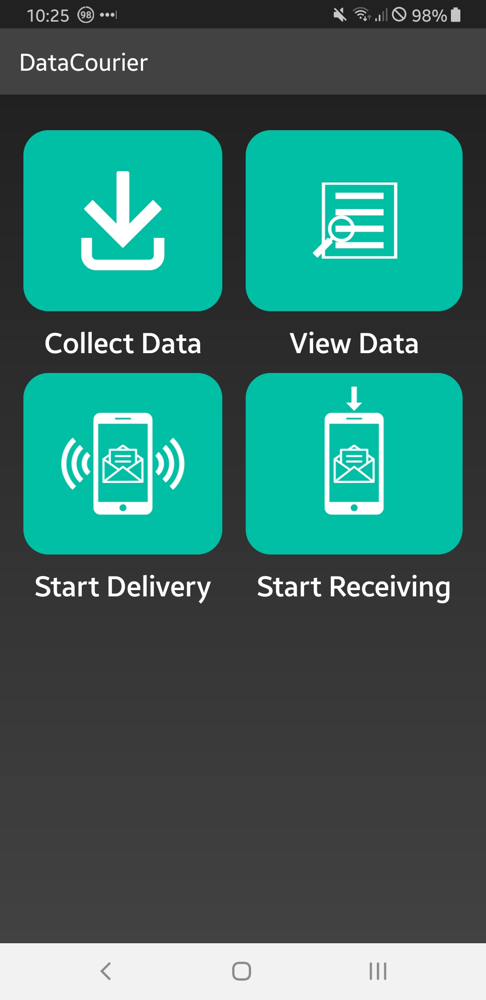
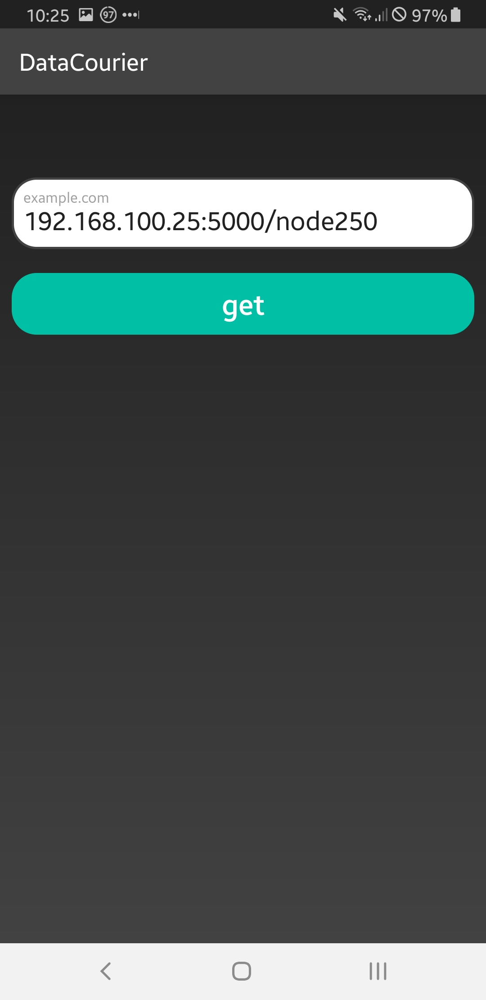
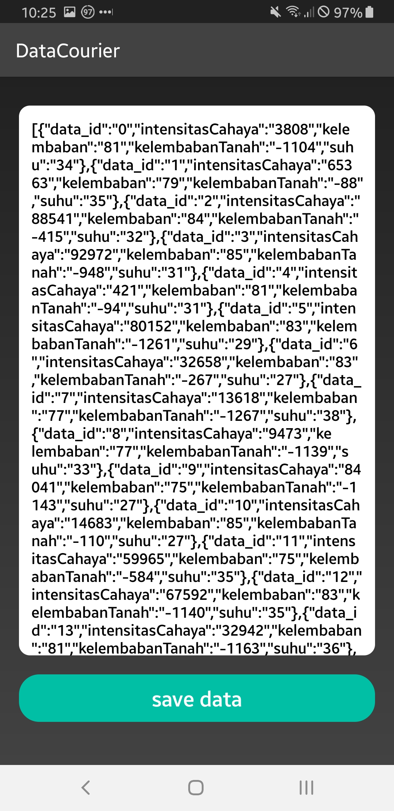
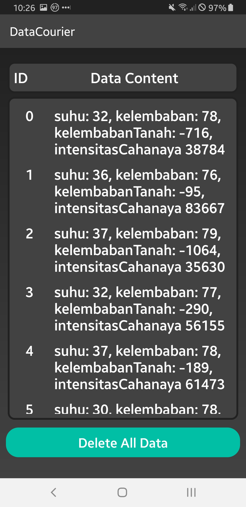
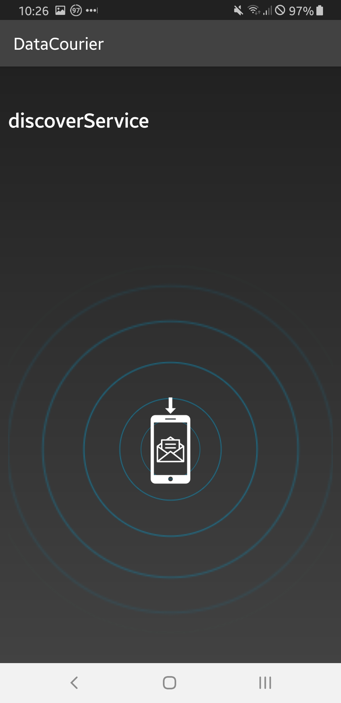
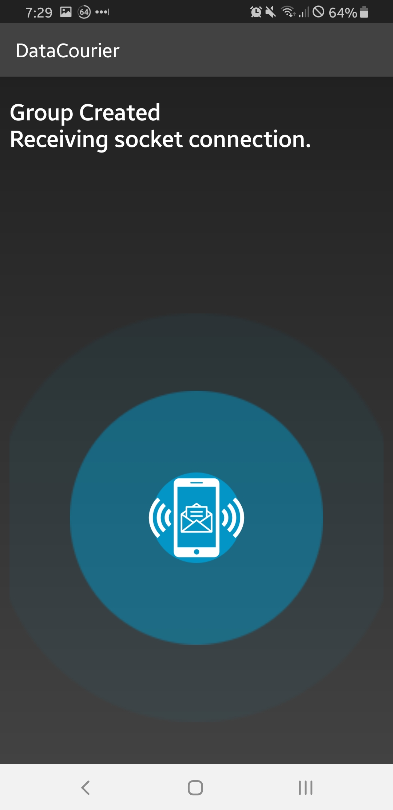

# DataCourier
Android DTN Solution for remote IoT establishment.

1. The app user take data from remote IoT Establishment without Internet Connection Available
2. The user try move to another area with Internet Connection available
3. If the app user met another app user first, app will relay data to another app using wifi direct with flooding algorithm
4. If the app find Internet connection, send data to data centre. Job Done

